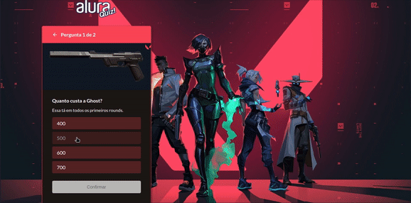

<h1 align="center">
    Imersão React Alura <br/>
    Valorant Quiz
</h1>

<p align="center">	
  
	
  <a href="https://www.linkedin.com/in/jonathanpauluze/">
    
  </a>
  
  <a href="https://github.com/jonathanpauluze/valorant-quiz/commits/main">
    
  </a>

</p>
<p align="center">
  <a href="#information_source-Sobre-o-desafio">Sobre</a>&nbsp;&nbsp;&nbsp;|&nbsp;&nbsp;&nbsp;
  <a href="#rocket-tecnologias-e-ferramentas">Tecnologias</a>&nbsp;&nbsp;&nbsp;|&nbsp;&nbsp;&nbsp;
  <a href="#wrench-como-rodar-o-projeto">Como rodar o projeto</a>
</p>

## :information_source: Sobre o projeto

Projeto construído durante a Imersão React da [Alura](https://www.alura.com.br/c). Trata-se de um jogo de quiz com a temática do jogo [Valorant](https://playvalorant.com/pt-br/) da Riot Games, construído com React utilizando o framework NextJS.



## :rocket: Tecnologias e Ferramentas
- [React](https://reactjs.org)
- [NextJS](https://nextjs.org)
## :wrench: Como rodar o projeto

É necessário ter instalado:
- [Git](https://git-scm.com)
- [Node.js](https://nodejs.org/)
- [Yarn](https://yarnpkg.com/)

### Faça um clone do projeto

```bash
$ git clone https://github.com/jonathanpauluze/valorant-quiz

# ou com a CLI do GitHub
$ gh repo clone jonathanpauluze/valorant-quiz
```

### Instale as dependências
```bash
# Acesse o diretório do projeto
$ cd valorant-quiz

# Instale as dependências
$ yarn
```

### Inicie a aplicação
```bash
$ yarn dev
```


<p align="center">Feito com ♥ por <a href="https://linkedin.com/in/jonathanpauluze" target="_blank">Jonathan Pauluze</a></p>
